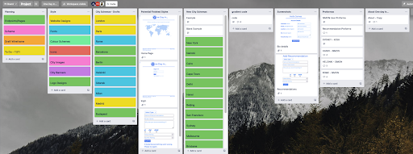
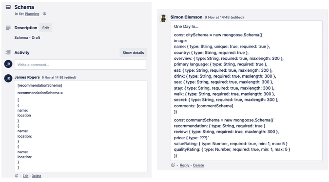
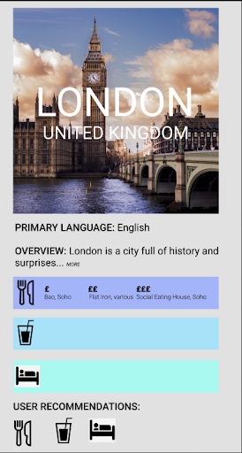
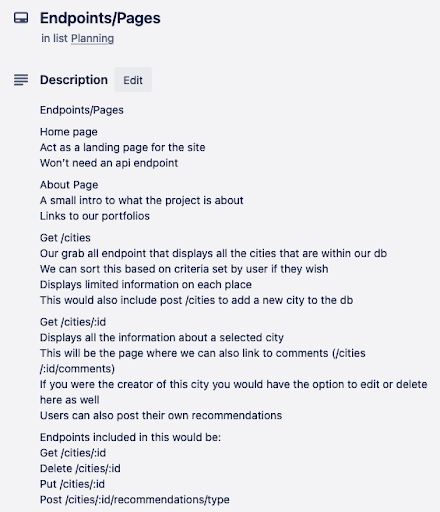

# Project Three: One Day In #

Teams of Three  
Time Frame: 9 days  
Visit the site: https://bit.ly/jronedayin  

Login Credentials:  
Username: James  
Password: Jamespass  

## Overview: ##

For my third project as part of General Assembly’s Software Engineering course, we were assigned into teams and told to make a full MERN stack application in just over a week. In our first meeting together, my team decided to create a travel website, but to make it differ slightly from the Trip Advisor’s of the world, ours would be specific for if you had 24 hours in a specific city.

## The Brief: ##

* **Build a full-stack application** by making your own back-end and your own front-end.
* **Use an Express API** to serve your data from a Mongo database.
* **Consume your API with a separate front-end** built with React.
* **Be a complete product** which most likely means multiple relationships and CRUD functionality for at least a couple of models.
* **Implement thoughtful user stories/wireframes** that are significant enough to help you know which features are core MVP and which you can cut.
* **Have a visually impressive design** to kick your portfolio up a notch and have something to wow future clients & employers. ALLOW time for this.
* **Be deployed online** so it's publicly accessible.

## Technologies Used: ##

* Node.js
* MongoDB
* Express
* Bcrypt
* Mongoose
* jsonwebtoken
* React
* Axios
* SASS
* React Bootstrap
* Insomnia
* Git
* GitHub
* Trello Board (planning and timeline)

## Code Installation: ##

* Clone or download the repo, then in your terminal run the following commands:
* Start the database by running: `mongod --dbpath ~/data/db`
* In the OneDayIn folder, run: `yarn`
* Start the back-end server first running: `yarn serve`
* Start the front-end by first running: `cd client` followed by: `yarn start`

## Day 1 - Planning:##

Once we had decided the theme for the app the next thing we did was create a Trello board to help us keep on top of our planning. Here we created sections for our wireframes, endpoints, and models that we would need to have done in order to get sign-off. We ended up using this Trello board across the entire project.

With that made we got to work on the planning. The first thing we decided upon was the amount of models we would need and what the schema for each would end up looking like. We settled on two models, the user and the cities, however we had a wide range of relationships established for both. The city schema would also have embedded relationships with hotspots and recommendations, which then in turn had an embedded relationship with ratings.

After we had established the model and the information we would be storing for each city, we moved on to our wireframe for our individual cities. We knew the main list of cities would be a list with images and so felt this was the more important feature to focus on. We decided at this point that we wanted this site to be controlled by the admins, and so they would decide what cities are available. The page would then list the admin suggestions for each category we created, but also have an option to view user recommendations as well. As a stretch goal we wanted to add a feature that showed the highest rated user recommendation on the main page.

Once we had designed the wireframe and had the models sorted, we moved on to the end points and the pages we wanted to make. This would give us a clear indication of what functionality we would need to design in the back-end, as well as make it easier to divide the workload on the front-end. On this we also added in some more stretch goals we wanted to potentially achieve if we had time.

