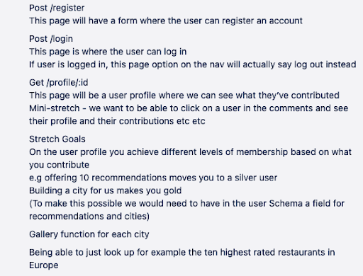
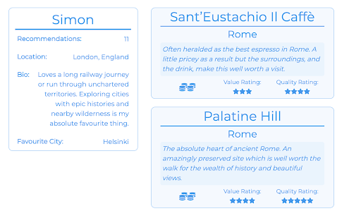
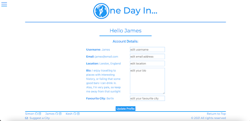
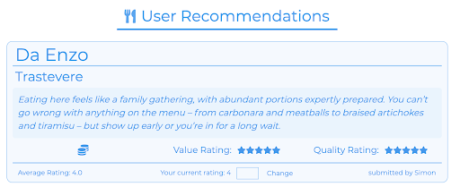
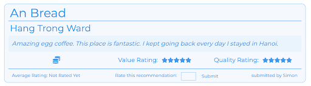
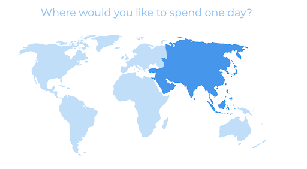

# Project Three: One Day In #

Teams of Three  
Time Frame: 9 days  
Visit the site: https://bit.ly/jronedayin  

Login Credentials:  
Username: James  
Password: Jamespass  


## Overview: ##

For my third project as part of General Assembly’s Software Engineering course, we were assigned into teams and told to make a full MERN stack application in just over a week. In our first meeting together, my team decided to create a travel website, but to make it differ slightly from the Trip Advisor’s of the world, ours would be specific for if you had 24 hours in a specific city.


## The Brief: ##

* **Build a full-stack application** by making your own back-end and your own front-end.
* **Use an Express API** to serve your data from a Mongo database.
* **Consume your API with a separate front-end** built with React.
* **Be a complete product** which most likely means multiple relationships and CRUD functionality for at least a couple of models.
* **Implement thoughtful user stories/wireframes** that are significant enough to help you know which features are core MVP and which you can cut.
* **Have a visually impressive design** to kick your portfolio up a notch and have something to wow future clients & employers. ALLOW time for this.
* **Be deployed online** so it's publicly accessible.


## Technologies Used: ##

* Node.js
* MongoDB
* Express
* Bcrypt
* Mongoose
* jsonwebtoken
* React
* Axios
* SASS
* React Bootstrap
* Insomnia
* Git
* GitHub
* Trello Board (planning and timeline)

## Code Installation: ##

* Clone or download the repo, then in your terminal run the following commands:
* Start the database by running: `mongod --dbpath ~/data/db`
* In the OneDayIn folder, run: `yarn`
* Start the back-end server first running: `yarn serve`
* Start the front-end by first running: `cd client` followed by: `yarn start`

## Day 1 - Planning:##

Once we had decided the theme for the app the next thing we did was create a Trello board to help us keep on top of our planning. Here we created sections for our wireframes, endpoints, and models that we would need to have done in order to get sign-off. We ended up using this Trello board across the entire project.


With that made we got to work on the planning. The first thing we decided upon was the amount of models we would need and what the schema for each would end up looking like. We settled on two models, the user and the cities, however we had a wide range of relationships established for both. The city schema would also have embedded relationships with hotspots and recommendations, which then in turn had an embedded relationship with ratings.


After we had established the model and the information we would be storing for each city, we moved on to our wireframe for our individual cities. We knew the main list of cities would be a list with images and so felt this was the more important feature to focus on. We decided at this point that we wanted this site to be controlled by the admins, and so they would decide what cities are available. The page would then list the admin suggestions for each category we created, but also have an option to view user recommendations as well. As a stretch goal we wanted to add a feature that showed the highest rated user recommendation on the main page.


Once we had designed the wireframe and had the models sorted, we moved on to the end points and the pages we wanted to make. This would give us a clear indication of what functionality we would need to design in the back-end, as well as make it easier to divide the workload on the front-end. On this we also added in some more stretch goals we wanted to potentially achieve if we had time.




With all of this prep work done, we were able to get signed off. Overnight we split a task between the three of us to create some cities to add into our database, so when we created the back-end we could instantly seed it with information to display.

## Days 2 & 3 - Creating the Back-End: ##

We all worked together to create the back-end, with one team member sharing his screen while I talked through the processes and functionality we needed to add. We didn’t create all the functionality here, instead working on completing our MVP. This meant we didn’t create the functionality for the ratings, although we did create the model so it would be easier to add this feature in at a later time. Instead we focused on having CRUD functionality for cities and recommendations. After we created each function, we tested it on Insomnia to ensure the back-end was receiving the correct authorizations. We then seeded the database with the cities we had created the night before and were ready to move to the front-end.


## Days 4, 5, 6, & 7 - Creating the Front-End: ##

It was at this part of the project that we created three separate branches and each worked on our own machines, splitting the workload of the front-end. Simon got to work using React Bootstrap to add a hamburger to our site, as well as made changes to the models in the back-end that were needed. He also created two images for each city, a banner and a thumbnail image, and edited them all to be the correct size before hosting them online and adding the urls into the seed database. Kesh started off working on the login and sign up page, whereas I took on the rest of the front-end.

The first thing I needed to build was the page that listed all of the cities, as from this I would then be able to reach the single city pages. This was done fairly simply, by making an API request to get all the cities and then mapping through them, creating a component for each city.

```
const AllCitiesList = () => {
  const [cities, setCities] = useState([])


  useEffect(() => {
    const getCityData = async () => {
      const allCities = await getCities()
      allCities.sort((a,b) => (a.name > b.name ? 1 : -1))
      setCities(allCities)
    } 
    getCityData()
  }, [])

  return (
    <section className='city-list'>
      <ul>
        {cities.map((city) => (
          <li key={city._id}>
            <CityCard {...city} />
          </li>
        ))}
      </ul>
    </section>
  )
}
```

Once this was done I was able to create the single city pages, which is where most of the front-end work went into. I started by making a plain page with all of the information on it that I wanted. Then, I did some styling, as I was going to be spending a lot of time on this page and wanted to get a feel for how it might look. This wasn’t the final design, but still made it easier to work with visually.


Once all of the information was present, I got to work making the links at the bottom of the page link to the user suggestion pages for each city. From here I was able to add in the CRUD functionality for user suggestions, which required some slight tweaking of the back-end to get it working the way I needed. The main change I added to the back-end was to the user model, creating a field to store all the recommendations they had made. This meant I could add in functionality later to display the user’s recommendations on their user profile. This also meant I had to add some extra lines into the create recommendation function in the back-end, so it would not only add the recommendation to the city, but the user as well. The same went for editing and deleting recommendations.

We kept in touch as a team throughout the day and shared the progress of what we were working on. It was unfortunately at this time it became apparent that one of the members of the team wasn’t putting in the required work, and so I took on their workload as well as I continued to build the front-end, putting in long hours each day to ensure we would not fall behind. This meant picking up sections I had not originally planned to, such as the user profile section.

There were two different aspects I made for this, the first being a page to display user information, such as their username, a bio, their favourite city (and added in a function to this where if their favourite city was on our database, it would link to that page), as well as all the recommendations created by that user.



The second was a page to allow the user to edit the information on their own profile. Sadly, due to time constraints, I didn’t manage to populate the form with the data already held here, but I did display that data so the user could still see what they had already.




Once I managed this I decided to add in the rating function on the user recommendations. To do this I needed to do a bit of work in the back-end to add the functionality, although because we had already made the model this saved some time. Once the functionality was up and running, I implemented the system seen below, which would either encourage the user to make a rating, or if they had already rated, allow them to change their rating.




This stopped a single user from being able to spam a recommendation with lots of high ratings, limiting them to one per recommendation. To do this I simply had to check each card and filter through the ratings, only returning results where the rating owner id matched the user id. If this list had any length, then I set a variable called userHasRated to true and populated information with their current rating information.

```
const checkUserRating = ratings.filter(rating => rating.owner === userId)
  if (checkUserRating.length){
    setUserHasRated(true
    setUserRating(checkUserRating[0].rating)
    setUserRatingId(checkUserRating[0]._id)
}

```
To display this information I needed to use multiple ternary operators, first to determine if the user was logged in, followed by if they had rated the recommendation already.

```
{isLoggedIn ?
   !userHasRated ?
     <form className='rec-rating' onSubmit={handleSubmit}>
       <h6>Rate this recommendation:</h6>
       <div className='form-field'><input className='rating' name='rating' type='number' min='1' max='5' onChange={handleNumberChange} /></div>
       <div className='form-field'><input type='submit' className='submit' value='Submit' /></div>
     </form>
     :
     <form className='rec-rating' onSubmit={handleEdit}>
       <h6>Your current rating: {userRating}</h6>
       <div className='form-field'><input className='rating' name='rating' type='number' min='1' max='5' onChange={handleNumberChange} /></div>
       <div className='form-field'><input type='submit' className='submit' value='Change' /></div>
     </form>
   :
   <div><h6>Please log in to rate this recommendation</h6></div>
}
```

Once I had finished with this functionality, I added links to all of the components I had made, so clicking on a username at the bottom of a recommendation took you to their user page, clicking on the city they had left a recommendation for took you to that city page, and clicking their recommendation title took you to those user recommendations for that specific city. To do this I had to make some more changes to the back-end, most notably adding the city to the recommendation schema, so I could access the information I needed for the links.

## Days 8 & 9 - Stretch Goals and Styling: ##

After we had worked apart for the last few days we got together and merged our projects, choosing to finish the work on one machine. I took the reins this time and shared my screen with the rest of the team, as I had built most of the front-end and so for styling purposes I knew the layout more. Before we got to work on the styling however, there was one more function we wanted to add, which was an interactive world map which would allow users to filter cities through their continent.




