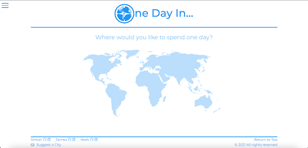

# Project Three: One Day In #

Teams of Three  
Time Frame: 9 days  
Visit the site: https://bit.ly/jronedayin  

Login Credentials:  
Username: James  
Password: Jamespass  

For my third project as part of General Assembly’s Software Engineering course, we were assigned into teams and told to make a full MERN stack application in just over a week. In our first meeting together, my team decided to create a travel website, but to make it differ slightly from the Trip Advisor’s of the world, ours would be specific for if you had 24 hours in a specific city.

